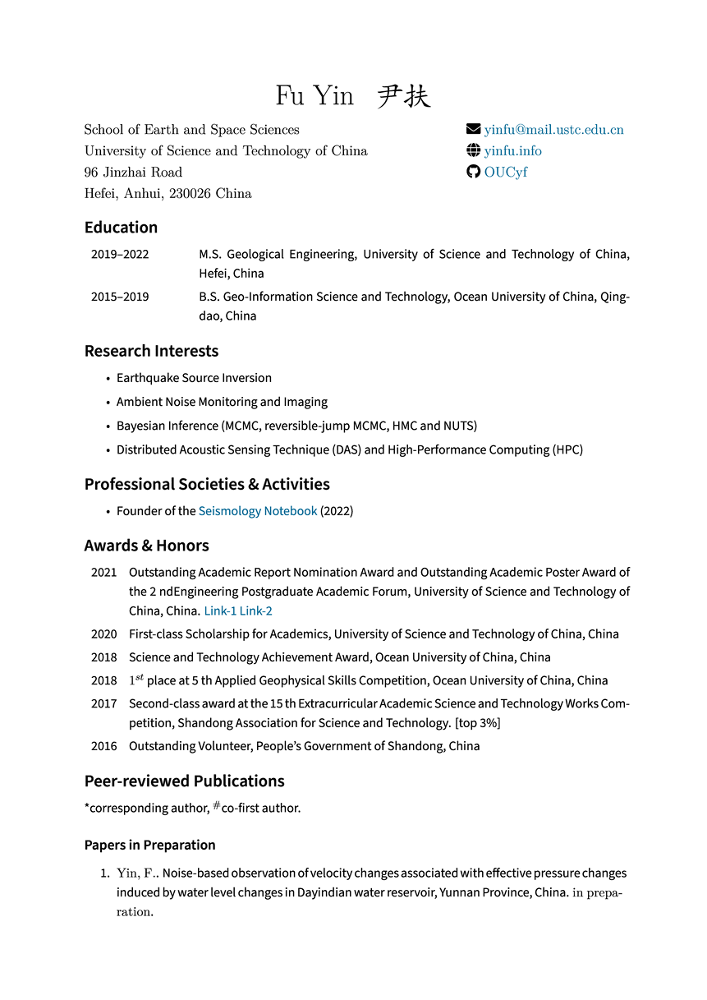

# Fu Yin (尹扶)'s Curriculum Vitae

The full **LaTeX** distribution are recommended in this template, and install via [TexLive](https://github.com/scottkosty/install-tl-ubuntu) on Linux, and via [MacTex](https://www.tug.org/mactex/) on MacOS.

## Build

1. **Git clone**:

		$ git clone git@github.com:OUCyf/CV.git

3. **Build via Makefile**:

		$ make

4. **Build via VSCode**:

   Please check **latex-workshop.latex.tools** and **latex-workshop.latex.recipes** options in `.vscode/settings.json` file.

## Download

Download my CV:

- [English version](https://github.com/OUCyf/CV/raw/gh-pages/cv_en.pdf)

- [Chinese version]() [not available now]

---

   

---

## Acknowledgemnt

The CV is modified from [TIAN Dongdong (田冬冬)'s Curriculum Vitae](https://github.com/seisman/cv)
